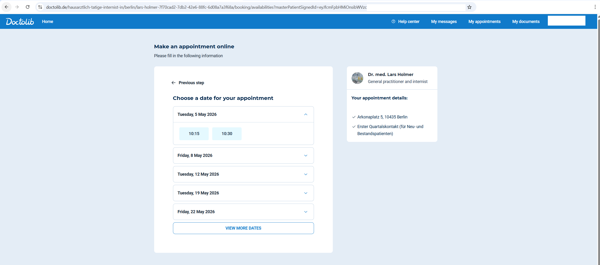

# doctolib-checker

`doctolib-checker` continuously checks Doctolib appointment availability and sends alerts through **ntfy.sh**, **email**, or both.

Before I was using this script https://github.com/Schlaurens/doctolib-checker but it was bit hard to deal with URLs so I wanted to create my own, so I would like to thanks to https://github.com/Schlaurens for the idea.

## 1. Install

Requires Python 3.11+.

```bash
pip install requests
```

## 2. Configure `settings.json`

The script reads all settings from `settings.json`.

```json
{
  "execution": {
    "check_in_n_seconds": 60
  },
  "checking_window": {
    "start": "",
    "end": "",
    "look_for_n_days": 15
  },
  "doctors": [
    "https://www.doctolib.de/hausarztlich-tatige-internist-in/berlin/claudio-lamprecht/booking/availabilities?specialityId=1286&telehealth=false&placeId=practice-639665&insuranceSectorEnabled=true&insuranceSector=public&motiveIds%5B%5D=8102915&pid=practice-639665&insurance_sector=public&source=profile"
  ],
  "notifications": {
    "ntfy": {
      "server": "https://ntfy.sh",
      "topic": "your-topic"
    },
    "email": {
      "sender": "your_gmail_address@gmail.com",
      "app_password": "your_16_char_gmail_app_password",
      "recipient": "recipient@example.com",
      "smtp_host": "smtp.gmail.com",
      "smtp_port": 587
    }
  }
}
```

### Settings explained

- `execution.check_in_n_seconds`: wait time between checks.
- `checking_window.start`: earliest appointment date you care about (`YYYY-MM-DD`). Empty = today.
- `checking_window.end`: latest appointment date you accept (`YYYY-MM-DD`). Empty = `start + 15 days`.
- `checking_window.look_for_n_days`: Doctolib API range (`limit`) per request.
- `doctors`: list of sources to check. Each item can be:
  - direct `availabilities.json` URL
  - booking URL (`/booking/availabilities?...`) — auto-resolved
  - doctor/search page URL — script tries to extract availability URLs

## 3. Which Doctolib link should you paste?

Use the link from the page where Doctolib already shows the **available timeslots**.



1. Open Doctolib and choose the **doctor**.
2. Choose the **examination/visit type**.
3. Continue until the page where you can see the calendar/timeslots.
4. Copy that URL from the browser address bar.
5. Paste it into `settings.json` in the `doctors` list.

Best link type is usually a booking URL like:

`https://www.doctolib.de/hausarztlich-tatige-internist-in/berlin/claudio-lamprecht/booking/availabilities?specialityId=1286&telehealth=false&placeId=practice-639665&insuranceSectorEnabled=true&insuranceSector=public&motiveIds%5B%5D=8102915&pid=practice-639665&insurance_sector=public&source=profile`

If you paste a doctor page or search page instead, the script will still try to resolve it automatically at runtime.

> **Warning**
> If you are logged in to Doctolib, your URL can look different (for example extra patient/session parameters). That is normal and still okay to use.

## 4. Run

Choose at least one notification channel:

```bash
python doctolib_checker.py --notify
python doctolib_checker.py --email
python doctolib_checker.py --notify --email
```

If you run without `--notify` or `--email`, the script exits with an error.

## 5. Test notifications

```bash
python doctolib_checker.py --notify-test
python doctolib_checker.py --email-test
```

## Gmail setup note

For Gmail, use an **App Password** (not your normal account password):

1. Enable 2-Step Verification on Google account.
2. Create App Password for Mail.
3. Put that value in `notifications.email.app_password`.
